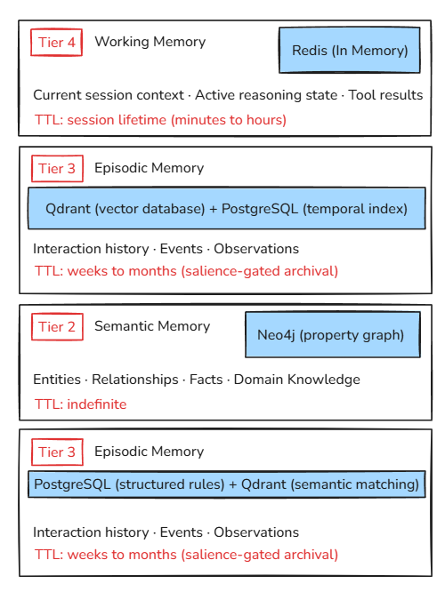

## Memory Architecture

# Agentic Memory System Architecture

## Overview

The Agentic Memory System uses a **4-tier architecture** with different storage backends optimized for specific memory types and access patterns.

---

## Memory Tiers

### TIER 4: Working Memory (Redis)
**Purpose:** Current session context and active reasoning state

**Storage:** Redis (in-memory, session TTL)

**Key Features:**
- Fast access (sub-millisecond)
- Session-lifetime (TTL ~1 hour)
- Auto-cleanup on session end

---

### TIER 3: Episodic Memory (PostgreSQL + Qdrant)
**Purpose:** Raw events, conversations, and observations

**Storage:**
- PostgreSQL: Structured data + temporal indexing
- Qdrant: Vector embeddings for semantic search

**Key Features:**
- Complete interaction history
- Vector similarity search
- Temporal queries
- Evidence layer for semantic facts

---

### TIER 2: Semantic Memory (Neo4j)
**Purpose:** Long-term knowledge, entities, and relationships

**Storage:** Neo4j (property graph database)

**Key Features:**
- Relationship traversal
- Entity resolution
- Pattern-based reasoning
- Knowledge graph queries

---

### TIER 1: Procedural Memory (PostgreSQL + Qdrant)
**Purpose:** Rules, workflows, and procedures

**Storage:**
- PostgreSQL: Structured procedures
- Qdrant: Semantic matching for procedure retrieval

**Key Features:**
- Step-by-step procedures
- Context-aware retrieval
- Skill learning from patterns
- Workflow automation

---

## Memory Lifecycle

### Write Path
User interactions flow from Working Memory through Episodic Memory, then via consolidation to Semantic and Procedural Memory.

### Consolidation Process
Background process periodically analyzes episodic memories, clusters them by semantic similarity, extracts patterns using LLM, and creates semantic memories with provenance tracking.

### Read Path
Hybrid retrieval across all tiers - Redis for recent context, Qdrant for episodic similarity, Neo4j for semantic relationships - with reranking and context building for LLM response.

---

## Technical Implementation

### Memory Node Structure
Each memory node contains identity fields, content data, temporal information, scope parameters, relational connections, and epistemic metadata including confidence scores and provenance tracking.

### Storage Routing
Memories are automatically routed to appropriate storage backends based on memory type - Working to Redis, Episodic to Qdrant+PostgreSQL, Semantic to Neo4j, and Procedural to PostgreSQL+Qdrant.

### Hybrid Retrieval
Query processing searches across all relevant tiers simultaneously, combining results from vector similarity search, graph traversal, and pattern matching, then deduplicates and reranks based on composite scores.

---

## Key Technical Principles

### 1. Provenance Tracking
Always maintain source memory IDs for semantic facts to enable traceability and validation of extracted knowledge.

### 2. Salience Scoring
Memory relevance calculated based on recency, access frequency, and confidence scores using exponential decay models.

### 3. Contradiction Detection
Flag conflicting information for human review to maintain knowledge integrity and resolve ambiguities.

### 4. Scope Isolation
Enforce memory boundaries by agent, user, session, and organization to ensure proper data isolation in multi-tenant environments.

---

## Performance Characteristics

**Working Memory:** Redis storage with sub-millisecond latency, GB-scale capacity, and hour-level retention.

**Episodic Memory:** PostgreSQL + Qdrant with 10-50ms latency, TB-scale capacity, and months-to-years retention.

**Semantic Memory:** Neo4j with 50-200ms latency, TB-scale capacity, and indefinite retention.

**Procedural Memory:** PostgreSQL + Qdrant with 20-100ms latency, TB-scale capacity, and indefinite retention.

---

## Best Practices

### DO
- Maintain provenance for semantic memories
- Implement gradual memory decay
- Use hybrid retrieval for complex queries
- Run consolidation periodically (daily/hourly)
- Enforce scope boundaries for multi-tenant systems

### DON'T
- Delete episodic memories immediately after consolidation
- Store all memories in all tiers (unnecessary duplication)
- Ignore contradiction detection
- Skip salience scoring
- Use only one storage backend for all memory types

---

## Example Use Cases

### 1. Customer Support Bot
Current conversation context stored in Working Memory, individual interactions stored as Episodic Memory, and patterns extracted via consolidation become Semantic Memory about customer behavior.

### 2. Code Assistant
Debugging sessions stored as Episodic Memory with technical details, while successful troubleshooting patterns become Procedural Memory for future reference.

### 3. Personal Assistant
User preferences and communication patterns stored as Semantic Memory with entity relationships, enabling personalized responses based on historical behavior.

---

## Conversation Flow Example: How a Message Moves Through 4 Tiers

### Initial User Message
"Hey, I'm having trouble with PostgreSQL connection in my production environment. The connection keeps timing out after 30 seconds."

### TIER 4: Working Memory (Immediate Storage)
**When:** As soon as message is received
**Storage:** Redis with session TTL
**Content:** Full conversation context for current session
**Purpose:** Enable immediate response generation and context continuity

**Stored Data:**
- Session ID: current_active_session
- Current user message
- Assistant's previous responses
- Active troubleshooting state
- Tool results if any

### TIER 3: Episodic Memory (Durable Storage)
**When:** After initial processing
**Storage:** PostgreSQL (structured) + Qdrant (vector embedding)
**Content:** Individual interaction as episodic memory node
**Purpose:** Permanent record of events for future reference

**Stored Data:**
- Node ID: mem_abc123
- User ID: user_456
- Content: "User having PostgreSQL connection timeout issues in production"
- Timestamp: 2026-09-13T14:30:00
- Confidence: 1.0
- Metadata: category=technical, database=postgresql, severity=high
- Vector embedding for semantic search

### TIER 2: Semantic Memory (Knowledge Extraction)
**When:** During consolidation process (background job)
**Storage:** Neo4j knowledge graph
**Content:** Extracted entities and relationships
**Purpose:** Long-term knowledge about user and systems

**Extracted Relationships:**
- User → PostgreSQL (HAS_ISSUE_WITH)
- User → production_environment (WORKS_IN)
- PostgreSQL → connection_timeout (EXPERIENCES)
- User → 30_seconds (TIMEOUT_THRESHOLD)

**Knowledge Graph Node:**
- Content: "User experiences PostgreSQL connection timeouts in production"
- Source entity: user_456
- Target entity: PostgreSQL
- Relationship: HAS_ISSUE_WITH
- Confidence: 0.92
- Provenance: [mem_abc123, mem_def456] (source episodic memories)

### TIER 1: Procedural Memory (Skill Learning)
**When:** After multiple similar episodes + consolidation
**Storage:** PostgreSQL (structured procedures) + Qdrant (semantic matching)
**Content:** Learned troubleshooting procedures
**Purpose:** Reusable knowledge for similar future situations

**Learned Procedure:**
"When PostgreSQL connection timeout occurs in production:
1. Check network connectivity to database server
2. Verify connection pool settings
3. Review database server load and connection limits
4. Check firewall rules and security groups
5. Test with increased timeout parameter
6. Review slow query logs for performance issues"

**Metadata:**
- Applicability: database_troubleshooting
- Success rate: 0.87
- Last used: 2026-09-15
- Source episodes: 15 similar cases

---

### Complete Lifecycle Timeline

**T0 (0 seconds):** User message received → Working Memory (Redis)
**T1 (1 second):** Message processed → Episodic Memory (PostgreSQL + Qdrant)
**T24h (24 hours):** Consolidation runs → Semantic Memory (Neo4j)
**T7d (7 days):** Pattern recognition → Procedural Memory (PostgreSQL + Qdrant)

### Retrieval Example (3 months later)

**User Query:** "I'm having database issues again"

**Hybrid Retrieval Process:**
1. Redis: Check current session context (none)
2. Qdrant: Find similar episodic memories → "PostgreSQL connection timeout" (similarity: 0.89)
3. Neo4j: Traverse semantic relationships → User → PostgreSQL → HAS_ISSUE_WITH
4. Qdrant: Match procedural memory → "PostgreSQL troubleshooting procedure" (similarity: 0.94)

**Context Provided to LLM:**
"User has history of PostgreSQL connection timeout issues in production environment. Previous resolution involved checking network connectivity, connection pool settings, and reviewing database server load. Consider the learned troubleshooting procedure."

---

## Configuration

Memory system configuration includes connection settings for Redis, Qdrant, Neo4j, PostgreSQL backends, and LLM parameters for embedding generation and text processing.

